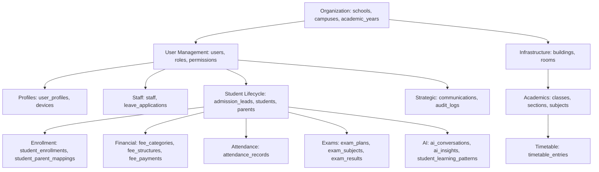

# Migration Order and Dependency Graph

## 1. Migration Dependency Graph (Conceptual)

## 2. Initial Migration Order
To ensure foreign key integrity, migrations must be applied in the following sequence:

1.  **Core Foundation:** `schools`, `campuses`, `academic_years`.
2.  **Infrastructure:** `buildings`, `rooms`, `houses`.
3.  **Identity:** `users`, `roles`, `permissions`, `role_permissions`, `user_roles`.
4.  **Profiles & Metadata:** `user_profiles`, `devices`, `login_history`.
5.  **Academics Base:** `classes`, `sections`, `subjects`.
6.  **Staff:** `staff`, `leave_applications`.
7.  **Student & Parent Core:** `parents`, `admission_leads`, `students`.
8.  **Relationships & Enrollment:** `student_parent_mappings`, `student_enrollments`, `application_documents`, `application_schedules`, `admission_applications`.
9.  **Events & Operations:** `timetable_entries`, `attendance_records`.
10. **Evaluations:** `exam_plans`, `exam_subjects`, `grade_scales`, `exam_results`.
11. **Assignments:** `assignments`, `assignment_submissions`.
12. **Finance:** `fee_categories`, `fee_structures`, `student_fee_discounts`, `fee_payments`.
13. **Supporting Modules:** `communications`, `books`, `book_loans`, `transport_routes`, `inventory_items`, `documents`.
14. **Audit & AI:** `audit_logs`, `ai_conversations`, `ai_messages`, `ai_insights`, `ai_generated_content`, `student_learning_patterns`, `ai_vector_store`.
